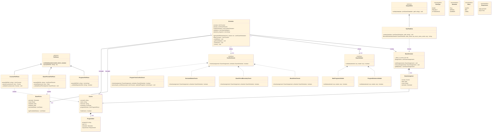

# System Architecture

## UML Class Diagram

The following diagram illustrates the core structure, domain models, parsers, validators, and the scheduler engine of the system.

## Core Components

- **Parsers (`src/parsers/`)**: Responsible for reading the raw text input files and converting them into strongly typed domain objects (`Course`, `ExamPeriod`, etc.).
- **Validators (`src/validators/`)**: Validate the structural integrity of the input files before any scheduling logic runs.
- **Checkers (`src/logic/`)**: Enforce the business rules of the exam schedule (e.g., conflict checking, spacing rules).
- **Scheduler (`src/logic/Scheduler.py`)**: The central engine that orchestrates the generation of valid schedules.
