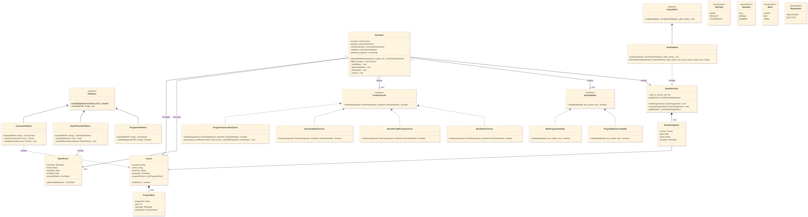

# System Architecture

## UML Class Diagram

The following diagram illustrates the core structure, domain models, parsers, validators, and the scheduler engine of the system.

**Version 1.0:**

**Version 2.0:**
https://yuval-keren.github.io/

**Version 3.0:**

## Architecture

* **`src/models/` (Domain):** Contains the core data structures (`Course`, `ExamPeriod`, `ExamSchedule`, `ProgramEntry`) and Enumerations (`EvalType`, `Semester`, `Moed`, `Requirement`).
* **`src/file_io/` (Input Management):** Contains all logic regarding reading files and writing output schedules while performing validations and parsing.
  * `validators/` (Validation):** Ensures data integrity before the engine runs.
    * `FileValidator`: Verifies files exist, are not empty, and are valid UTF-8.
    * `MaxProgramsValidator`: Ensures no more than 5 programs are selected at once.
    * `ProgramExistenceValidator`: Ensures selected program codes exist in the master list.
  * `parsers/` (Parsing):** Parses the input files into structured data.
    * `FileParser`: Abstract parser for the input files.
    * `CourseParser`: Parses the courses file.
    * `ExamPeriodParser`: Parses the exam periods file.
    * `ProgramParser`: Parses the programs file.
    * `ParserFactory`: Creates the appropriate parser based on the input file.
  * `writers/` (Writing):** Writes the final schedule to a file.
    * `TextFileWriter`: Writes the final schedule to a text file.
    * `OutputWriter`: Handles the output of the final schedules.
* **`src/logic/` (Engine):** The brain of the system. 
  * `checkers/`: contains the logic for checking constraints.
    * `IConstraintsChecker`: Interface for checking constraints.
    * `ProgramYearConflictChecker`: Checks for program-year conflicts.
    * `MoedConflictChecker`: Checks for moed-level conflicts.
  * `Scheduler`: Main class that runs the scheduling algorithm.
  * `SlotBuilder`: Contains the logic for building slots.
  * `observers/` : Contains observer classes that are used to notify the GUI of the scheduling process.
    * `ISchedulerObserver`: Interface for observer classes.
    * `CollectingScheduleObserver`: Observer that collects the final schedule.
    * `StreamingScheduleObserver`: Observer that streams the final schedule step by step.
* **`src/infrastructure` (Infrastructure):** Contains the infrastructure layer logic.
  * `cache/`: Contains the cache logic.
    * `CachedInputLoader` : In charge of loading input data from the cache.
    * `DataCache` : Contains the cached data.
    * `DiskCacheRepository` : In charge of storing the cached data in the disk.
    * `FileChangeDetector` : Detects changes in the input files and invalidates the cache.
  * `concurrency/`: Contains the concurrency logic.
    * `SchedulerProcessRunner` : Runs the scheduler in a separate processes for better performance.
    * `SchedulerWorker` : Listens to the queue and updates the GUI with the schedules per process.
    * `QueueScheduleObserver` : Updates the queue with the schedules per process.
  * `repositories/`: Contains the repository logic.
    * `IDataRepository` : Interface for data repositories.
    * `SQLiteScheduleRepository` : Repository for storing schedules in a SQLite database.
* **`src/application/` (Application):** Contains the application layer logic.
  * `dto/` (Data Transfer Objects): contains the data transfer objects used to pass data between the GUI and the engine.
    * `ScheduleDTO` : Contains the schedule in a format that can be used by the GUI. 
    * `ScheduleDTOAdapter` : Adapter that converts each `Schedule` to `ScheduleDTO` pickable object.
  * `services/` (Services): contains the service logic.
    * `FileImportService` : Service for importing files.
    * `SchedulingService` : Service for scheduling exams.
    * `ScheduleExportService` : Service for exporting schedules.
    * `InputDataMerger` : Service for merging input data.
    * `ViewModelMapper` : Service for mapping ViewModels to DTOs.
    * `InputCacheService` : Service for caching input data.
  * `state/` (State Management): contains the state management logic.
    * `AppState` : Manages the current state of the application.
    * `InputDataState` : Manages the input data state of the application.
    * `SchedulerResultState` : Manages the schedule results and the state of the scheduling process.
    * `HybridScheduleResultState` : Manages the hybrid schedule results and the state of the scheduling process.
  * `viewmodels/` (View Models): contains the view model logic.
    * `AppController` : Manages the application state and dispatches commands.
    * `ApplicationFacade` : Interface between the GUI and the application layer.
    * `ImportBoundary` : Import input data using the facade.
* **`src/gui/` (GUI):** Contains the GUI logic.
  * `common/` (Common): contains the common GUI logic.
    * `components/`: contains the common GUI components.
      * `CalendarWidget.py` : used to display a calendar.
      * `CalendarEditorWidget.py` : used to display an editable calendar.
      * `OutputCalendarWidget.py` : used to display an output calendar.
      * `ExclusionModel.py` : used to exclude dates from calendar for the schedule editor.
      * `CourseListWidget.py` : used to display a list of courses.
      * `HeaderWidget.py` : used to display the main header of the application.
    * `helpers` : contains the helper functions for the GUI.
  * `features/` (Features): contains the GUI features logic.
    * `input/` : folder that contains the input feature logic including widgets and input screen presenter.
    * `output/` : folder that contains the output feature logic including widgets and output screen presenter.
  * `core/` (Core): contains the core GUI logic.
    * `styles/` : folder that contains all style choices for GUI in particular a pallete of colors for the entire system as well as individual stylings per widget\feature.
    * `app` : file containing the main application window.
    * `screen` : file containing the different screens of the application.
    * `ScreenRouter` : used for routing between screens based on user actions.
* **`src/entrypoints/` (Entry Points):** Contains the entry point logic.
  * `Main/` (Main): contains the main logic.
* **`src/GuiMain.py` (Main):** Contains the main logic.
