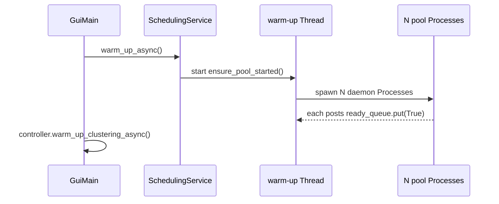
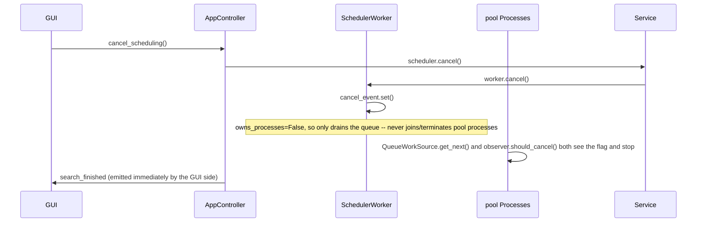

# Concurrency Architecture

## 1. Purpose

This document explains the concurrency architecture used in the Exam Scheduler project:

- Which kinds of background work the system runs, and on what (GUI thread, `QThread`, OS process).
- How work, results, progress, and cancellation flow between the GUI, threads, and worker processes.
- Why the scheduler uses real OS processes while sorting and clustering use Qt threads.
- Why the worker-process pool is created once and reused, instead of spawned per run.
- Which primitives (`Queue`, `Event`, `Value`, `Lock`) are shared between processes/threads, and why each one exists.
- How the implementation follows SOLID principles.
- How to safely add a new background task in the future.

The companion document, [error-handling-architecture-en.md](error-handling-architecture-en.md), explains how *failures* are normalized once they cross a boundary. This document explains the boundaries themselves — the threads, processes, and channels a value travels through before it reaches the GUI.

## 2. Problem This Solves

The scheduler's backtracking search and the clustering pipeline are CPU-heavy:

- Generating schedules walks a huge combinatorial search space.
- Clustering does an `ORDER BY RANDOM()` full-table scan plus several passes of scikit-learn auto-K fitting.
- Sorting runs a SQL `ORDER BY` over the full score table.

If any of this ran directly on the GUI thread, Qt's event loop would freeze: no repaint, no button clicks, no window dragging, for seconds at a time. A second, unrelated problem is the CPython GIL: pure-Python CPU-bound work on a `QThread` does **not** run in parallel with other Python code, because only one thread can hold the GIL at a time. Background *processes* are required for true parallel CPU work; background *threads* are enough only when the heavy part runs in C code that releases the GIL (SQLite, sklearn/numpy) or when the work is I/O-bound.

A naive fix — `Process(target=..., args=...)` spawned fresh on every button click — has its own cost: spawning a Python process and re-importing this module is the dominant share of click-to-results latency on Windows. So the architecture also has to solve *process lifecycle*, not just *process existence*.

## 3. Core Idea — Three Tiers

The system separates concurrency into three tiers, each with a distinct contract:

1. **The GUI thread (Qt event loop).** Owns all widgets. Must never block for more than a few milliseconds. Only this thread may touch Qt widgets directly.
2. **`QThread` workers.** Run inside the same process, but off the GUI thread. Used for work that is *either* I/O-bound (waiting on a multiprocessing `Queue`) *or* CPU-bound work that happens to run inside C extensions that release the GIL (SQLite, numpy/sklearn). Communicate back to the GUI thread exclusively through Qt signals — the only thread-safe way to reach Qt widgets.
3. **OS processes (`multiprocessing.Process`).** Run the real CPU-bound backtracking search, fully parallel, immune to the GIL. Communicate with the main process only through `multiprocessing.Queue`, `Event`, and `Value` — never by sharing Python objects directly, since each process has its own memory space.

A fourth, lighter-weight category exists alongside these: plain `threading.Thread` (not `QThread`) for short, fire-and-forget background tasks that don't need Qt signals — e.g. priming a module import, or feeding a work queue. These are daemon threads with no return channel back to the GUI other than a shared queue they write into.

## 4. Architecture Components

### 4.1 `SchedulingService` — the persistent worker-process pool

Location: [`src/application/services/SchedulingService.py`](../src/application/services/SchedulingService.py)

This is the orchestrator for schedule generation. Its central design decision is that **the worker processes are not created per run** — they are created once, lazily or eagerly, and reused for every subsequent "Generate" click for the lifetime of the app.

State it owns (all created together in `ensure_pool_started`, guarded by `self._pool_lock`):

| Field | Type | Purpose |
| --- | --- | --- |
| `_pool_processes` | `List[Process]` | The long-lived worker processes (daemon=True). |
| `_pool_work_queue` | `Queue` | Workers pull `WorkUnit`s from here. |
| `_pool_result_queue` | `Queue` | Workers push `SCHEDULE_BATCH` / `PROGRESS` / `FINISHED` / `ERROR` messages here. |
| `_pool_control_queue` | `Queue` | Main process pushes one "new run" payload per worker here. |
| `_pool_ready_queue` | `Queue` | Each worker pushes `True` when it becomes idle and can take a new run. |
| `_pool_cancel_event` | `Event` | Shared flag; setting it tells every worker (and the feeder thread) to stop. |
| `_pool_result_counter` | `Value("q", 0)` | Shared atomic counter so all processes can respect one global `max_results` cap. |

`warm_up_async()` starts the pool on a background `threading.Thread` at app launch (see [`GuiMain.py:111`](../src/GuiMain.py)), so the OS process spawn cost lands while the user is loading files, not on their first click. `ensure_pool_started()` is idempotent and double-checked-locked, so it is safe to call again from `generate_async()` without creating a second pool.

### 4.2 `_persistent_worker_loop` — what runs inside each pooled process

Each pool process runs this loop forever (until it receives `None` on the control queue):

```python
while True:
    ready_queue.put(True)          # tell the main process "I'm free"
    payload = control_queue.get()  # block until a new run arrives
    if payload is None:
        break
    ... run one generation via _run_scheduler_process ...
```

This is the mechanism that lets the *same* OS process serve many different "Generate" clicks: it parks on `control_queue.get()` between runs instead of exiting.

### 4.3 `_pool_start_run` — handing a new run to already-running workers

Location: [`SchedulingService.py:243`](../src/application/services/SchedulingService.py)

Before starting a new run, this method must first wait until *every* worker has posted to `_pool_ready_queue` — including a worker that is still winding down from a run that was just cancelled. This is necessary because the pool's queues, cancel event, and result counter are **reused** across runs; if a worker from the previous run were still mid-flight, it could read this run's freshly-cleared state, or write stale results into the new run's repository. In steady state (workers already idle) this returns immediately; it only blocks meaningfully right after a cancel.

Once every worker is confirmed idle, it resets the shared `cancel_event` and `result_counter`, drains both queues, and pushes one `(courses, selected_programs, slots, config, max_results, batch_size)` payload per worker onto `control_queue`.

### 4.4 `IWorkSource` / `QueueWorkSource` — dynamic work-stealing

Location: [`src/infrastructure/concurrency/IWorkSource.py`](../src/infrastructure/concurrency/IWorkSource.py), [`QueueWorkSource.py`](../src/infrastructure/concurrency/QueueWorkSource.py)

`IWorkSource` is a one-method abstraction (`get_next() -> Optional[WorkUnit]`) that decouples *how a process gets its next task* from *what the process does with it* (`SchedulerProcessRunner`). The only implementation, `QueueWorkSource`, pulls `WorkUnit`s from the shared `work_queue` with a short poll timeout — `queue.empty()` is documented as unreliable on a `multiprocessing.Queue`, so the real stop signal is a sentinel `None` value, not an emptiness check. Because every process pulls from the *same* queue instead of owning a fixed slice up front, fast processes automatically pick up more work than slow ones — dynamic load balancing instead of a static per-process budget.

### 4.5 `SearchSpacePartitioner` / `WorkUnit` — decomposing the problem

Location: [`src/logic/parallel/SearchSpacePartitioner.py`](../src/logic/parallel/SearchSpacePartitioner.py), [`WorkUnit.py`](../src/logic/parallel/WorkUnit.py)

A `WorkUnit` is a small, immutable, picklable value: just the list of dates already fixed for the first few exam slots. It is deliberately *not* a full partial schedule object, so that passing thousands of these between threads and into queues stays cheap. `SearchSpacePartitioner` runs the real backtracking scheduler in a shallow, breadth-first way to enumerate valid prefixes (each one a `WorkUnit`), splitting the broadest unsplit branch first until there are roughly `num_processes * WORK_UNITS_PER_WORKER` units. This guarantees every unit is reachable (no impossible starting points get queued) without ever materializing the full search tree.

### 4.6 `_feed_work_queue` — partitioning runs on its own thread

Location: [`SchedulingService.py:55`](../src/application/services/SchedulingService.py)

Partitioning the problem can itself take noticeable time, so it never runs on the GUI thread. It runs on a plain daemon `threading.Thread` (not a `QThread` — it needs no Qt signal, only to push `WorkUnit`s into a shared queue that the pool processes already know how to drain). It pushes one `None` sentinel per worker process after the real units, which is how each `QueueWorkSource.get_next()` eventually returns `None` and the process exits its loop cleanly. On error, it reports through the same queue (`("ERROR", payload)`) the workers use, so a partitioning failure surfaces through the exact same path as a worker crash. It also calls `work_queue.cancel_join_thread()` — a documented workaround for a Windows multiprocessing bug where the implicit feeder thread for a `Queue` can hang process exit.

### 4.7 `SchedulerProcessRunner` — the loop inside each worker process

Location: [`src/infrastructure/concurrency/SchedulerProcessRunner.py`](../src/infrastructure/concurrency/SchedulerProcessRunner.py)

This is the code that actually executes inside a pool process for the duration of one run. It builds its own local `Scheduler`, then loops: `work_source.get_next()` → rebuild real `ExamAssignment` seeds from the `WorkUnit`'s raw dates → `scheduler.generateSchedules(...)` for that subtree → repeat, until `get_next()` returns `None`. One `QueueScheduleObserver` is reused across all work units handled by this process, so schedule batches can span unit boundaries instead of flushing a half-empty batch per unit. Any exception escaping the loop is caught here and reported through `observer.on_error(build_process_error_payload(e, "scheduling"))` — never re-raised across the process boundary, since an uncaught exception in a `multiprocessing.Process` target does not propagate to the parent at all, it just kills that one process silently.

### 4.8 `QueueScheduleObserver` — the only channel out of a worker process

Location: [`src/infrastructure/concurrency/QueueScheduleObserver.py`](../src/infrastructure/concurrency/QueueScheduleObserver.py)

A worker process cannot touch the GUI, the SQLite repository, or any object living in the main process — it has its own memory space. This observer is the *sole* outbound channel: every schedule found, every progress tick, every error, and the final completion notice all become one of four message types put onto the shared `result_queue`:

| Message | Payload | Meaning |
| --- | --- | --- |
| `("SCHEDULE_BATCH", (data, count, scores))` | zlib-compressed packed rows | A batch of found schedules, ready to insert into SQLite as-is. |
| `("PROGRESS", value)` | int | Best-effort progress signal (today mostly superseded by the GUI-side polling timer — see 4.10). |
| `("FINISHED", None)` | — | This process has no more work units; SchedulerWorker still waits for one per process. |
| `("ERROR", payload)` | str or `AppErrorInfo.to_payload()` dict | A crash inside this process; see [error-handling-architecture-en.md §6.5](error-handling-architecture-en.md). |

Three details matter here:

- **Batching + compression.** Schedules are buffered locally and flushed only every `batch_size` (1,000) schedules, then zlib-compressed at level 1. Sending each schedule individually through IPC would dominate runtime; one compressed batch amortizes both the pickling and the `Queue` IPC overhead.
- **Compact encoding.** When `slots` are known, schedules are packed as small per-slot date *indexes* (`encode_schedule`/`pack_rows`) rather than full DTOs — this is what makes batches small enough to move through a `Queue` quickly at scale.
- **Global result cap via a shared `Lock`.** `_reserve_result_slot()` takes `result_counter.get_lock()` before incrementing the shared `Value`, so two processes racing to claim the last few result slots cannot both succeed and overshoot `max_results`. Once the limit is hit, it also sets `cancel_event` — itself the mechanism that asks *every other process* to stop, not just this one.

### 4.9 `SchedulerWorker` — the `QThread` bridge into the GUI

Location: [`src/infrastructure/concurrency/SchedulerWorker.py`](../src/infrastructure/concurrency/SchedulerWorker.py)

This is the only object allowed to read `result_queue` and the only object allowed to emit the Qt signals the GUI listens to. It is a `QThread` for one reason: Qt signals emitted from a `QThread` are queued and delivered safely on the receiving (GUI) thread, whereas a plain background thread calling into Qt widgets directly is undefined behavior.

Its `run()` loop:

```python
while True:
    msg_type, payload = queue.get(timeout=1.0)   # never blocks forever
    handler = dispatch[msg_type]                  # SCHEDULE_BATCH / PROGRESS / ERROR / FINISHED
    if not handler(payload):
        break
finally:
    self._shutdown()                               # always runs, even on error/cancel
```

A 1-second timeout on every `queue.get()` is deliberate: it is the only way this loop notices a silently-dead process (no `FINISHED`, no `ERROR`, process just gone) without blocking forever.

It carries an important flag, `owns_processes`, because it has two different lifecycles depending on the caller:

- `owns_processes=True` (legacy/standalone use, and the unit tests): this worker started the processes itself, so it is also responsible for `process.start()`, `process.join()`, and `process.terminate()` on shutdown.
- `owns_processes=False` (the real `SchedulingService.generate_async` path): the processes belong to the long-lived pool. This worker must **never** join or terminate them — doing so would kill processes the pool needs to serve the *next* "Generate" click. It only ever signals them via the shared `cancel_event`, and otherwise just drains stray messages.

`schedules_batch_found` carries only an `int` (the batch size), not the schedules themselves — the actual data was already written to SQLite by this same thread (`self._repository.insert_compressed_batch(...)`) before the signal is emitted. The GUI thread reacts to the count, not the payload.

### 4.10 `AppController` — wiring and the progress-polling timer

Location: [`src/application/AppController.py`](../src/application/AppController.py)

`AppController` lives on the GUI thread. It connects to `SchedulerWorker`'s four signals (`generate_schedules`, around line 183) and always disconnects the *previous* worker's signals before connecting a new one (`_disconnect_worker`), so a stale worker's late-arriving signal can never call a handler meant for the new run.

Cancelling and restarting deserve a specific note: `generate_schedules()` calls `self._worker.cancel(); self._worker.wait(2000)` before starting a new run. Because the persistent pool reuses the same `result_queue` across runs, the *previous* `QThread`'s `run()` loop must have actually exited before a new `SchedulerWorker` starts reading that same queue — otherwise the old thread could still consume messages meant for the new run. `QThread.wait()` blocks the GUI thread briefly here, but only for the bounded time cancellation takes to settle (typically under a second), which is judged an acceptable trade against the alternative of two threads racing on one queue.

Progress is **not** read from the `PROGRESS` queue messages in production. Instead, `_start_progress_timer()` starts a `QTimer` (interval `PROGRESS_POLL_INTERVAL_MS = 500`) on the GUI thread that polls `self._schedule_state.count()` — itself backed by the SQLite repository's row count — and emits `progress_updated`. This keeps the cross-process IPC channel reserved for `SCHEDULE_BATCH`/`FINISHED`/`ERROR` only, and avoids needing to throttle a high-frequency `PROGRESS` message stream from N processes.

### 4.11 `SortWorker` and `ClusterWorker` — `QThread` for GIL-releasing work

Location: [`src/gui/features/output/workers/SortWorker.py`](../src/gui/features/output/workers/SortWorker.py), [`src/infrastructure/concurrency/ClusterWorker.py`](../src/infrastructure/concurrency/ClusterWorker.py)

Both are deliberately simple — a `QThread` subclass with two signals (`ready`/`finished` and `failed`) and a `run()` that wraps one call in `try/except`:

```python
def run(self) -> None:
    try:
        data = self._controller.compute_sort_data(self._priority)   # SortWorker
        self.ready.emit(data)
    except Exception as e:
        info = self._errors.map(e, {...})
        self.last_error = info
        self.failed.emit(info.user_message)
```

These do **not** use a separate OS process, and that is intentional, not an oversight. `SortWorker`'s heavy part is a SQL `ORDER BY` executed inside SQLite's C extension; `ClusterWorker`'s heavy part is `sklearn`/`numpy` numerical code. Both release the GIL while the actual number-crunching happens in C, so a Python `QThread` genuinely runs concurrently with the GUI thread for the parts that matter — spawning a whole OS process (with its pickling overhead for the input/output) would be pure overhead here, unlike the scheduler's backtracking search, which is pure Python and would not parallelize at all without real processes.

Each presenter (`OutputScreenPresenter`, `ClusterOverviewPresenter`) keeps the worker as an instance attribute (`self._sort_worker`, `self._worker`) for the worker's entire lifetime — a `QThread` with no surviving Python reference is eligible for garbage collection while still running, which crashes the app. Presenters never join with `wait()` on these; they let the `ready`/`finished`/`failed` signal arrive asynchronously on the GUI thread and react there.

### 4.12 `SQLiteScheduleRepository` — the shared resource all of the above writes through

Location: [`src/infrastructure/repositories/SQLiteScheduleRepository.py`](../src/infrastructure/repositories/SQLiteScheduleRepository.py)

This repository's single SQLite connection is opened with `check_same_thread=False` and is shared between the GUI thread (reads, while paging through results) and the `SchedulerWorker` thread (writes, while inserting batches). Every public method wraps its SQL in `with self._lock:` (`threading.Lock`), because SQLite connections are not safe for concurrent use from multiple threads without external serialization — this is a thread lock, not a multiprocessing one, since this object only ever lives inside the main process. `WAL` journal mode is enabled so that a long-running write does not starve concurrent reads as badly as the default rollback journal would.

## 5. Concurrency Primitives Used, and Why

| Primitive | Used for | Why this one |
| --- | --- | --- |
| `multiprocessing.Process(daemon=True)` | The 4 (or N) persistent scheduler workers | Real parallel CPU work, immune to the GIL; `daemon=True` so they die automatically if the main app exits abnormally. |
| `multiprocessing.Queue` (×4: control, ready, work, result) | All cross-process communication | The only safe way to move data between processes; each queue has one direction and one message shape so producers/consumers stay simple. |
| `multiprocessing.Event` (`cancel_event`) | Telling every process and the feeder thread to stop | A single shared boolean flag that is cheap to check (`is_set()`) in a hot loop, and safe to set from any process/thread. |
| `multiprocessing.Value("q", 0)` + `.get_lock()` | The global `max_results` counter | A small shared integer that multiple processes increment; the built-in lock prevents a lost-update race when two processes reserve a slot at once. |
| `threading.Lock` (`SchedulingService._pool_lock`) | Guarding lazy pool creation | Two near-simultaneous calls to `ensure_pool_started()` (e.g. warm-up thread + first `generate_async`) must not create two pools. |
| `threading.Lock` (`SQLiteScheduleRepository._lock`) | Guarding the shared SQLite connection | SQLite is not thread-safe across an unsynchronized shared connection. |
| `threading.Thread(daemon=True)` | `warm_up_async`, `_feed_work_queue`, `warm_up_clustering_async` | Fire-and-forget background work with no Qt-signal return path needed; a plain thread is lighter than a `QThread` when nothing needs to reach a widget. |
| `QThread` + `pyqtSignal` | `SchedulerWorker`, `SortWorker`, `ClusterWorker` | The only thread-safe way to deliver a result back to Qt widgets; signals emitted off-thread are queued and delivered on the receiving thread's event loop. |
| `QTimer` | GUI-side progress polling | Runs *on* the GUI thread by design — it is not concurrency at all, just a way to avoid a tight poll loop blocking anything. |

## 6. Lifecycle

### 6.1 Startup (app launch)



The pool spawn cost (the dominant share of click-to-results latency on Windows) lands here, during idle time, instead of on the user's first click.

### 6.2 One generation run

```mermaid
sequenceDiagram
    participant GUI
    participant Controller as AppController
    participant Service as SchedulingService
    participant Feeder as feeder Thread
    participant Pool as pool Processes
    participant Worker as SchedulerWorker (QThread)
    participant Repo as SQLiteScheduleRepository

    GUI->>Controller: generate_schedules(program_ids)
    Controller->>Controller: cancel + wait(2000) on any previous worker
    Controller->>Service: generate_async(...)
    Service->>Service: ensure_pool_started() (no-op if already up)
    Service->>Pool: _pool_start_run(): wait all ready, reset state, push run payload
    Service->>Worker: new SchedulerWorker(owns_processes=False); start()
    Service->>Feeder: start _feed_work_queue thread
    Feeder->>Pool: push WorkUnits, then one None per process
    Pool->>Pool: each pulls WorkUnits via QueueWorkSource until None
    Pool->>Worker: ("SCHEDULE_BATCH", ...) / ("PROGRESS", ...) via result_queue
    Worker->>Repo: insert_compressed_batch(...)
    Worker->>Controller: schedules_batch_found(count) [Qt signal]
    Pool->>Worker: ("FINISHED", None) ×N
    Worker->>Controller: search_finished() [Qt signal]
    Controller->>GUI: search_finished
```

### 6.3 Cancellation



The next `generate_schedules()` call's `_pool_start_run()` is what actually *waits* for the cancelled processes to settle back to idle (via `ready_queue`) before handing them the next run.

### 6.4 Shutdown (app close)

`AppController.on_app_closing()` → `cancel_scheduling()` then `scheduler.shutdown_pool()`: sets `cancel_event`, pushes one `None` per process onto `control_queue` (the signal `_persistent_worker_loop` checks to break out of its `while True`), joins each process with a short timeout, and force-`terminate()`s any process that didn't exit in time. This is the only place a pool process is ever told to actually exit rather than go idle.

### 6.5 Sort / Cluster worker lifecycle

Simpler, because there is no persistent pool: a presenter creates a fresh `SortWorker`/`ClusterWorker`, connects its two signals, calls `start()`, and keeps a reference until either `ready`/`finished` or `failed` arrives. There is no `cancel()` — these are short, bounded, read-only computations; if the user navigates away before completion, the presenter's `_is_active` flag (checked in `_on_sort_ready`) just ignores the late signal instead of acting on stale data.

## 7. Why Processes for Scheduling but Threads for Sort/Cluster?

| | Scheduler search | Sort | Clustering |
| --- | --- | --- | --- |
| Where the time goes | Pure-Python backtracking | SQLite `ORDER BY` (C) | sklearn/numpy fit (C) |
| Releases the GIL? | No | Yes | Yes |
| Needs true parallelism? | Yes — splits work across cores | No — one query | No — one fit |
| Mechanism | `multiprocessing.Process` ×N, work-stealing queue | `QThread` | `QThread` |
| IPC cost paid | Yes (pickling `WorkUnit`s, compressed batches) | None (shared in-process call) | None (shared in-process call) |

A `QThread` running pure-Python backtracking would not run any faster than the GUI thread doing it directly — the GIL serializes them either way; it would only stop the GUI from *freezing*, not make the search faster. The scheduler genuinely needs N processes to use N cores. Conversely, spinning up an OS process for a single SQL query would add pickling and process-spawn overhead with zero parallelism benefit, since the query itself already runs outside the GIL.

## 8. Why a Persistent Pool Instead of Per-Run Processes?

The straightforward design — spawn `Process(target=..., args=...)` fresh inside `generate_async()`, join everything in `cancel()`/on completion — is simpler to reason about and is in fact still what `SchedulerWorker(owns_processes=True)` supports (and what the unit tests exercise directly). It was rejected for the real GUI path because, on Windows, process creation re-imports this module and pays full interpreter cold-start cost on *every* "Generate" click — measured as the dominant share of click-to-results latency.

The persistent pool amortizes that cost to once per app session (`warm_up_async`, during idle time) at the cost of more state to manage: queues and the cancel/counter primitives must be *reset* between runs rather than recreated, and `_pool_start_run` must block until every worker is confirmed idle before reusing that shared state — both of which a fresh-process-per-run design would get for free, since "no leftover state" is the default until you decide to keep some.

## 9. SOLID Analysis

### 9.1 Single Responsibility Principle

- `WorkUnit` only describes a starting point.
- `SearchSpacePartitioner` only decomposes the search space.
- `QueueWorkSource` only hands out the next unit.
- `SchedulerProcessRunner` only runs the search loop for one process.
- `QueueScheduleObserver` only translates scheduler events into queue messages.
- `SchedulerWorker` only bridges the queue to Qt signals (and owns the queue-empty/process-alive judgment calls).
- `SchedulingService` only owns the pool's lifecycle and run orchestration.

No single class both partitions work, runs the search, and talks to Qt.

### 9.2 Open/Closed Principle

`IWorkSource` lets a new work-distribution strategy (e.g. a different stealing policy, or a static per-process slice) be added by implementing one method, without touching `SchedulerProcessRunner`. The four-message protocol (`SCHEDULE_BATCH`/`PROGRESS`/`FINISHED`/`ERROR`) on `result_queue` is a stable contract: `SchedulerWorker._dispatch` is a dict lookup, so a new message type is added by adding one entry and one handler method, not by editing existing handlers.

### 9.3 Liskov Substitution Principle

Anything implementing `IWorkSource.get_next()` is interchangeable from `SchedulerProcessRunner`'s point of view — it only needs *a* source of `Optional[WorkUnit]`, never inspecting which implementation it has.

### 9.4 Interface Segregation Principle

`IWorkSource` exposes exactly one method. `SchedulerWorker`'s dispatch handlers each take only the one payload shape they need; none of them needs to know about the others' message types.

### 9.5 Dependency Inversion Principle

`SchedulerProcessRunner` depends on `IWorkSource`, not on `QueueWorkSource` or on `multiprocessing.Queue` directly — which is what makes it testable with a fake in-memory work source instead of a real OS-level queue.

## 10. Recoverable vs Non-Recoverable, in Concurrency Terms

This mirrors [error-handling-architecture-en.md §8](error-handling-architecture-en.md), specialized to concurrency failures:

| Situation | Recoverable? | Handling |
| --- | --- | --- |
| User clicks Cancel | Yes | `cancel_event.set()`; processes stop at their next `get_next()`/`should_cancel()` check; pool stays alive for the next run. |
| One pool process crashes mid-run | No, for the current run | `SchedulerWorker` notices via `exitcode not in (0, None)` once the queue read times out, emits `SCHEDULER_PROCESS_CRASHED` (`INFRASTRUCTURE`/`CRITICAL`); the *pool* itself is not torn down, only that run is abandoned. |
| `result_queue.get()` raises an unexpected exception (IPC/queue failure) | No | Mapped with `fallback_code="SCHEDULER_IPC_ERROR"`, loop breaks, `_shutdown()` still runs. |
| Work-partitioning thread raises | Yes (the run reports a clean error; pool is untouched) | Reported via the same `("ERROR", payload)` path workers use, on `result_queue`. |
| `SortWorker`/`ClusterWorker` raises | Yes | `failed` signal with a mapped message; no process/thread state needs cleanup beyond letting the `QThread` finish. |
| App closes while a run is active | N/A — controlled shutdown | `on_app_closing()` cancels, then `shutdown_pool()` joins/terminates every pool process explicitly. |

## 11. How to Add a New Background Task in the Future

Ask, in order:

1. **Does the heavy part run in pure Python?**
   - Yes → it needs a real OS process to get parallelism, or at minimum to avoid blocking the GIL the GUI thread also needs. Follow the scheduler pattern: a `Process` target function, a `Queue` for results, an `Event` for cancellation.
   - No (it's calling into SQLite/numpy/sklearn/similar, or it's I/O-bound) → a `QThread` is enough. Follow the `SortWorker`/`ClusterWorker` pattern: `run()` wraps one call in `try/except`, maps the exception through `default_registry()`, emits a `ready`/`failed` (or `finished`/`failed`) signal pair.

2. **Will this run many times per session (e.g. on every click), or rarely?**
   - Many times, and process spawn cost would be felt → consider a persistent pool like `SchedulingService`'s, not a fresh `Process` per call.
   - Rarely / once → a fresh `Process` or `QThread` per call is fine; do not add pool-lifecycle complexity for something that runs once.

3. **Does the GUI need to react to results, or just know success/failure?**
   - Needs streaming partial results → give it a message protocol like `QueueScheduleObserver`'s (batched, with a `FINISHED` sentinel), and a dispatcher like `SchedulerWorker._dispatch`.
   - Just needs a final result or an error → a single `ready(object)`/`failed(str)` signal pair, like `SortWorker`.

4. **Whatever you build, keep a Python reference to the `QThread`/`Process` for its entire lifetime.** A `QThread` instance with no surviving reference is garbage-collected while still running and crashes the app; a `Process` object going out of scope does not kill the OS process but does lose your only handle to `join()`/`terminate()` it later.

5. **Never let an exception escape a `Process` target silently.** It will not propagate to the parent — it just kills that process. Always wrap the target in `try/except` and report through whatever channel (`Queue`) the parent is listening on, mapped through the same `ExceptionMapperRegistry` every other boundary uses (see [error-handling-architecture-en.md](error-handling-architecture-en.md)).

## 12. Testing Strategy

Tests should verify (and existing tests cover):

- `SchedulingService.generate_async` reuses the same pool across repeated calls (`test_generate_async_reuses_pool_across_calls`) rather than spawning new processes each time.
- `cancel()` with no active worker is a no-op; `cancel()` with an active worker sets the shared cancel state without raising.
- `SchedulerWorker` correctly distinguishes the `owns_processes=True` (joins/terminates) and `owns_processes=False` (never joins/terminates, only drains) lifecycles.
- `SchedulerProcessRunner` reports exceptions through `observer.on_error(...)` rather than letting them escape the process target.
- `SortWorker`/`ClusterWorker` map exceptions to a structured `AppErrorInfo` and store it on `last_error`, not just the string emitted on `failed`.
- `QueueWorkSource.get_next()` returns `None` on a set cancel event even with items still in the queue, and returns `None` (not raising) on a sentinel.
- The global result counter (`Value` + lock) does not overshoot `max_results` when multiple simulated processes race to reserve a slot.

Because real OS processes are slow and order-sensitive to spin up in unit tests, the existing suite (`tests/logic/integration/Test_SchedulingService.py`) mocks `Process`, `Queue`, and `Event` at the `multiprocessing` boundary and asserts on call patterns (e.g. that the pool is created once and reused) rather than running an actual parallel search end-to-end.

## 13. Summary

The current architecture separates:

- Where work runs: GUI thread, `QThread`, or OS process — chosen by whether the heavy part is pure Python and whether it needs true parallelism.
- How work gets distributed: a shared work-stealing queue instead of static per-process slices, via the `IWorkSource` abstraction.
- How results get back: a small, stable, batched message protocol over a `multiprocessing.Queue`, decoded only by `SchedulerWorker` and re-expressed as Qt signals.
- How lifecycle is managed: a persistent pool that is started once and reused, with explicit, narrow contracts for "can this worker join/terminate its processes" (`owns_processes`) and "has every process gone idle and is it safe to reuse shared state" (`_pool_start_run`'s ready-queue wait).

The design is appropriate because it:

- Keeps the GUI thread free regardless of which tier the work runs on.
- Gets genuine multi-core parallelism exactly where pure-Python CPU work needs it, and avoids needless process overhead where it does not.
- Pays the expensive cost (process spawn) once per session instead of once per click.
- Gives every background task — process or thread — one narrow, typed channel back to the part of the system that's allowed to touch the GUI.
- Composes directly with the error-handling architecture: every boundary in this document maps exceptions through the exact same registry described in [error-handling-architecture-en.md](error-handling-architecture-en.md), so a crash inside a worker process is exactly as safe, structured, and loggable as a crash on the GUI thread.

In short: this is tier-oriented concurrency architecture. Each piece of background work is placed on the cheapest tier that actually satisfies its requirement (responsiveness, parallelism, or both), and every channel between tiers carries a small, explicit, typed message instead of a shared mutable object.
