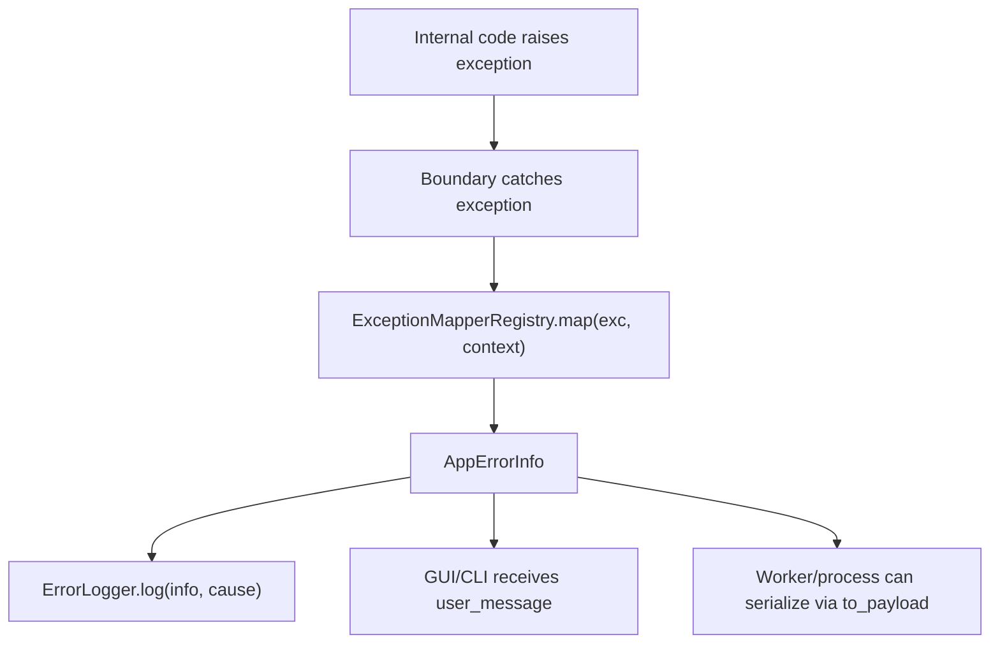
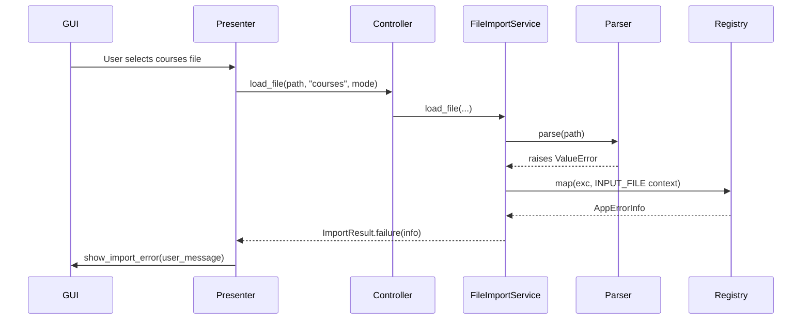
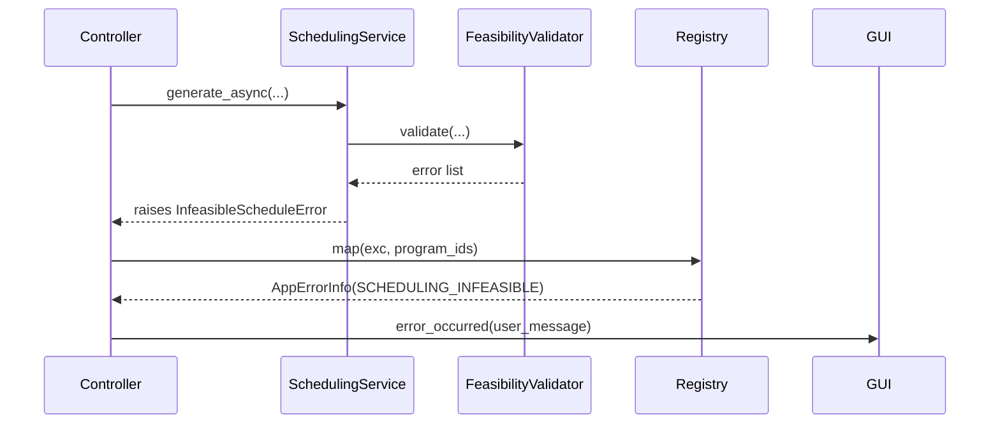
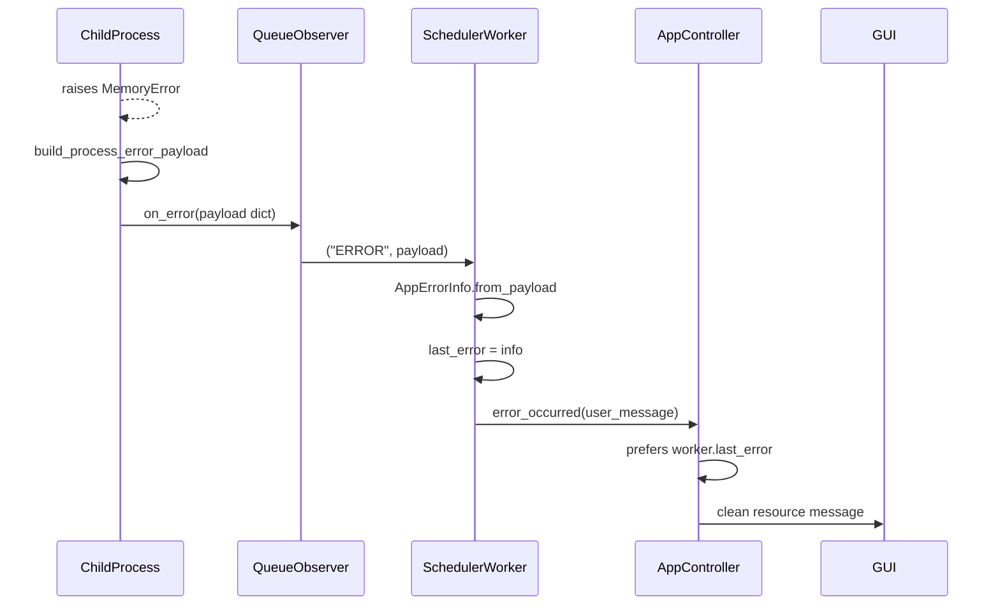
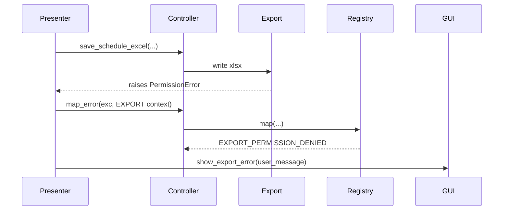

# Error Handling Architecture

## 1. Purpose

This document explains the error handling architecture used in the Exam Scheduler project:

- Which kinds of failures the system recognizes.
- How errors flow from internal layers to the GUI, CLI, threads, and worker processes.
- Which errors are recoverable and which are not.
- Why the system uses a model + typed exceptions + mapper registry + logger design.
- How the implementation follows SOLID principles, especially OCP.
- How to add new error types safely in the future.

The goal is not only to "catch exceptions". The goal is to make failures a structured part of the architecture. Every boundary-level error should have a stable code, category, severity, clean user message, technical log message, recovery policy, and context.

## 2. Problem This Solves

Before this layer, much of the system relied on:

- Generic `ValueError` and `RuntimeError`.
- `except Exception as e` in GUI code.
- Displaying `str(e)` directly to users.
- Worker/process errors passed as plain strings.
- Repeated error formatting in multiple presenters.
- No clear difference between user-fixable errors and infrastructure/resource failures.

That is acceptable in a small script, but it becomes weak in a larger application:

- Users may see overly technical messages.
- Developers may not get enough context for debugging.
- The system cannot clearly decide whether to retry, continue, or stop.
- Each screen needs to know too much about exception types.
- Adding a new failure case requires editing many catch blocks.

The chosen solution is a centralized application-level error layer. It lives in `src/application/errors` because the application layer is the boundary between domain/infrastructure code and GUI/CLI/runtime entry points.

## 3. Core Idea

The system separates three concerns:

1. **The original exception**  
   Examples: `ValueError`, `PermissionError`, `MemoryError`, `InfeasibleScheduleError`.

2. **The normalized application error description**  
   Represented by `AppErrorInfo`.

3. **The presentation channel**  
   GUI displays `user_message`, CLI prints `user_message`, and logs receive `technical_message`, context, and traceback.

Internal code may raise normal Python exceptions. Once an error crosses a system boundary, it is mapped to `AppErrorInfo`.

## 4. Architecture Components

### 4.1 `AppErrorInfo`

Location: `src/application/errors/ErrorModel.py`

`AppErrorInfo` is an immutable value object that fully describes one failure:

```python
AppErrorInfo(
    code: str,
    category: ErrorCategory,
    severity: ErrorSeverity,
    user_message: str,
    technical_message: str,
    recoverable: bool,
    context: dict,
)
```

Fields:

- `code`: stable machine-readable identifier, for example `RESOURCE_MEMORY_EXHAUSTED`.
- `category`: the subsystem or concern that failed.
- `severity`: how serious the failure is.
- `user_message`: safe message for users.
- `technical_message`: detailed message for logs.
- `recoverable`: whether the user or application can reasonably recover.
- `context`: structured metadata such as `path`, `operation`, `screen`, `stage`, or `file_type`.

`AppErrorInfo` also supports process-safe serialization:

- `to_payload()` converts it to a plain dictionary.
- `from_payload()` reconstructs it from that dictionary.

This is important because the scheduler runs in separate multiprocessing workers. Passing raw exception objects between processes is fragile; passing a plain dictionary is stable.

### 4.2 `ErrorCategory`

Current categories:

| Category | Meaning |
| --- | --- |
| `VALIDATION` | User input rejected by validation |
| `INPUT_FILE` | Bad, missing, unreadable input files |
| `SCHEDULING` | Scheduling engine or infeasible scheduling problem |
| `RESOURCE` | Memory or bounded resource exhaustion |
| `PERSISTENCE` | SQLite, disk cache, internal storage |
| `EXPORT` | TXT, Excel, or PDF export |
| `INFRASTRUCTURE` | Process crash, IPC, OS/runtime failure |
| `UNEXPECTED` | Anything not classified elsewhere |

The category is not meant to replace control flow. It gives the system and developers a consistent way to classify, present, and triage errors.

### 4.3 `ErrorSeverity`

Current severity levels:

| Severity | Meaning |
| --- | --- |
| `INFO` | Informational, usually not a real failure |
| `WARNING` | Expected/user-fixable problem |
| `ERROR` | Operation failed, application can continue |
| `CRITICAL` | Severe runtime or infrastructure failure |

In the CLI, severity also drives exit code:

- `INFO` -> `0`
- `WARNING` / `ERROR` -> `1`
- `CRITICAL` -> `2`

### 4.4 Typed Application Exceptions

Location: `src/application/errors/ApplicationErrors.py`

The hierarchy is intentionally shallow:

- `ApplicationError`
- `ValidationApplicationError`
- `InputFileApplicationError`
- `SchedulingApplicationError`
- `SchedulingInfeasibleError`
- `ResourceExhaustedError`
- `PersistenceApplicationError`
- `ExportApplicationError`
- `InfrastructureApplicationError`
- `UnexpectedApplicationError`

The system does not create a deep exception class hierarchy for every small case. The class describes the broad category. The exact failure kind is represented by `AppErrorInfo.code`.

Example:

- Do not create a class for every "Excel file locked" situation.
- Use an export error with `code="EXPORT_PERMISSION_DENIED"`.

This keeps catch sites stable and avoids changing many files when a new failure kind is added.

### 4.5 `ExceptionMapperRegistry`

Location: `src/application/errors/ExceptionMapper.py`

The registry is the central translation point:

```python
info = registry.map(exc, context)
```

It checks registered mappers in order. The first mapper that can handle the exception returns an `AppErrorInfo`.

Default order:

1. `ApplicationErrorMapper`
2. `InfeasibleScheduleMapper`
3. `MemoryErrorMapper`
4. `PermissionErrorMapper`
5. `FileNotFoundMapper`
6. `ValueErrorMapper`
7. `OSErrorMapper`
8. Unknown fallback

Order matters:

- `PermissionError` is an `OSError`, so it must be handled before `OSErrorMapper`.
- `MemoryError` must stay a `RESOURCE` failure even if a caller passes a different category in context.
- `ApplicationError` already contains an `AppErrorInfo`, so it should pass through unchanged.

### 4.6 `ErrorLogger`

Location: `src/application/errors/ErrorLogger.py`

`ErrorLogger` separates users from technical details:

- Users see only `user_message`.
- Logs receive `technical_message`, category, code, context, and traceback.

Main method:

```python
ErrorLogger().log(info, cause=exc)
```

It returns the same `AppErrorInfo`, making it easy to chain when needed.

## 5. General Error Flow



Internal layers can still raise ordinary exceptions. The rule is: once an exception crosses a system boundary, it must be mapped.

## 6. System Boundaries

### 6.1 CLI Boundary

Location: `src/main.py`

The CLI entry point wraps execution with a central catch:

```python
except Exception as exc:
    info = registry.map(exc, {"argv": sys.argv})
    error_logger.log(info, cause=exc)
    _report_and_exit(info)
```

Effects:

- Users do not see tracebacks.
- Every error gets a consistent exit code.
- File errors, validation errors, scheduling errors, memory errors, and unexpected errors go through the same path.

### 6.2 GUI Global Boundary

Location: `src/GuiMain.py`

The GUI installs a `sys.excepthook`.

If an exception escapes a Qt slot or the event loop:

- It is mapped to `AppErrorInfo`.
- It is logged with technical details.
- The user sees a safe `QMessageBox`.

This is a safety net. It does not replace local presenter-level handling.

### 6.3 Controller Boundary

Location: `src/application/AppController.py`

`AppController` owns:

- `self._errors = default_registry()`
- `self._error_logger = ErrorLogger()`

Important methods:

```python
map_error(exc, context) -> str
_emit_error(info, cause=None) -> None
```

Presenters call `map_error` instead of formatting `f"{error}"` themselves.

The controller logs the technical details and returns only the clean user message.

### 6.4 Import Boundary

Location: `src/application/services/FileImportService.py`

File import returns `ImportResult` instead of raising directly to the GUI.

`ImportResult` contains:

- `success`
- `loaded_count`
- `errors: List[str]` for backward compatibility.
- `error_details: List[AppErrorInfo]` for structured error details.

When validation or parsing fails:

```python
return ImportResult.failure(info)
```

Recovery policy:

- Missing file, empty file, bad format, and unreadable file are recoverable.
- The user can choose another file or fix the existing file.

Cache failures are treated differently:

- Cache read failure is logged and treated as a cache miss.
- Cache write failure is logged but does not fail the import.
- Reason: cache is an optimization, not the source of truth.

### 6.5 Scheduling Worker and Process Boundary

The scheduling engine runs in separate processes, so error handling has two boundaries:

1. Inside the child process.
2. In the GUI-side worker thread that reads queue messages.

Inside child processes:

- `SchedulingService` and `SchedulerProcessRunner` use `build_process_error_payload`.
- It maps the exception to `AppErrorInfo`.
- It serializes it to a plain dictionary.

In the main process:

- `SchedulerWorker` receives the queue payload.
- If it is a dictionary, it calls `AppErrorInfo.from_payload`.
- It stores the result in `last_error`.
- It emits `error_occurred` with only `user_message`.

In `AppController._handle_error_occurred`:

- If it receives a dictionary or `AppErrorInfo`, it logs and emits it.
- If it receives a legacy string, it prefers `self._worker.last_error`.
- If no structured error exists, it maps the string as an infrastructure error.

This preserves full error metadata while keeping existing GUI signals compatible.

### 6.6 Sort and Cluster Workers

`SortWorker` and `ClusterWorker`:

- Own a default registry.
- Map exceptions to `AppErrorInfo`.
- Store the structured error in `last_error`.
- Emit `failed` with the clean `user_message`.

The signal remains a string for compatibility, but structured details remain available.

### 6.7 Export Boundary

There are three export paths:

- TXT
- Excel
- PDF

TXT and Excel:

- Presenter catches the exception.
- Presenter calls `controller.map_error(error, context)`.
- GUI displays the returned user message.

PDF is different because the actual writing happens inside a view-layer helper:

`SchedulePdfExporter.export_schedule_pdf(...)`

The solution:

- The PDF exporter accepts an `on_error` callback.
- The screen passes `presenter.map_export_error`.
- The presenter maps through `controller.map_error`.

That keeps PDF failures inside the same error architecture.

## 7. Error and Recovery Policy

| Error | Mapper / Source | Category | Severity | Recoverable | Handling |
| --- | --- | --- | --- | --- | --- |
| Parser/validator `ValueError` | `ValueErrorMapper` | `VALIDATION` or context category | `WARNING` | Yes | Show parser/validator message |
| Missing input file | `FileNotFoundMapper` | `INPUT_FILE` | `ERROR` | Yes | User selects/fixes file |
| File permission problem | `PermissionErrorMapper` | Context category, often `EXPORT` or `INPUT_FILE` | `ERROR` | Yes | Tell user to close file/check permissions |
| Generic I/O failure | `OSErrorMapper` | Context category, default `PERSISTENCE` | `ERROR` | Yes | Safe file/disk failure message |
| No valid schedule possible | `InfeasibleScheduleMapper` | `SCHEDULING` | `WARNING` | Yes | User changes input or constraints |
| `MemoryError` | `MemoryErrorMapper` | `RESOURCE` | `CRITICAL` | No | Stop operation; suggest smaller input/tighter constraints |
| Scheduler process crash | worker/process payload | `INFRASTRUCTURE` | `CRITICAL` | No | Stop worker and log details |
| IPC/queue failure | `SchedulerWorker` | `INFRASTRUCTURE` | `CRITICAL` | No | Stop worker and clean up |
| Unknown exception | Registry fallback | Context category or `UNEXPECTED` | `ERROR` | Usually yes | Safe generic message and full technical log |
| Cache read/write failure | `FileImportService` + mapper | `PERSISTENCE` | `ERROR` | Yes | Log and continue without cache |

## 8. Recoverable vs Non-Recoverable

### Recoverable

Recoverable errors are failures the user or system can correct without restarting the entire application or trusting a broken runtime state.

Examples:

- Missing input file.
- Invalid input file format.
- Too many selected programs.
- No schedule possible with current constraints.
- Excel file is open and cannot be overwritten.
- Cache read/write failure.

Behavior:

- Show a clean message.
- Do not crash the application.
- Let the user fix input or retry.

### Non-Recoverable

Non-recoverable errors mean the current operation cannot safely continue.

Examples:

- `MemoryError`.
- Scheduler child process crash.
- IPC communication failure.
- Broken multiprocessing runtime state.

Behavior:

- Stop the current operation.
- Clean up workers/processes.
- Show a safe user message.
- Log the technical details.
- Do not try to continue the partially failed operation.

## 9. Why Not One Huge `ErrorHandler` Class?

A single class with a large `if isinstance(...)` ladder would work initially:

```python
if isinstance(exc, MemoryError):
    ...
elif isinstance(exc, PermissionError):
    ...
elif isinstance(exc, ValueError):
    ...
```

But it would become harder to maintain:

- Every new error kind requires editing the central class.
- The class grows without a clear boundary.
- Unit testing each error family is harder.
- It violates the Open/Closed Principle.

The mapper registry is better:

- Each mapper owns one exception family.
- The registry only coordinates mapper order.
- New error support is added by adding a mapper.
- Boundaries do not change.

## 10. Why Not Replace Every `ValueError`?

Replacing every internal `ValueError` with a custom exception would be over-engineering.

Many internal `ValueError`s are perfectly reasonable:

- Parser detects an invalid line.
- Config has an invalid value.
- Enum value is unknown.
- Domain object is constructed incorrectly.

The original problem was not that `ValueError` exists. The problem was letting raw `ValueError` escape to users.

Policy:

- Internal domain/parser code may raise clear ordinary exceptions.
- System boundaries must map them.
- Only important application-level failures need typed `ApplicationError` subclasses.

This keeps domain code simple while making boundary behavior professional.

## 11. SOLID Analysis

### 11.1 Single Responsibility Principle

Each component has one reason to change:

- `AppErrorInfo` describes an error.
- `ApplicationError` carries an `AppErrorInfo`.
- A mapper converts one exception family.
- `ExceptionMapperRegistry` chooses a mapper.
- `ErrorLogger` logs technical details.
- Presenters display user-facing messages.

No class is responsible for mapping, logging, GUI display, and business decisions all at once.

### 11.2 Open/Closed Principle

The system is open for extension and closed for modification:

- Add a new mapper for a new exception family.
- Register it before broader mappers.
- Do not change `AppController`, `main`, `GuiMain`, or presenters.

Example future mapper:

```python
class DatabaseLockedMapper:
    def can_handle(self, exc):
        return isinstance(exc, DatabaseLockedError)

    def map(self, exc, context):
        return AppErrorInfo(...)
```

### 11.3 Liskov Substitution Principle

Every `ApplicationError` can be treated as an `ApplicationError`.

Consumers do not need to know whether it is:

- `ExportApplicationError`
- `ResourceExhaustedError`
- `InfrastructureApplicationError`

All of them expose the same `info` contract.

### 11.4 Interface Segregation Principle

Mapper interface is small:

```python
can_handle(exc) -> bool
map(exc, context) -> AppErrorInfo
```

Mappers do not need to know about GUI, CLI, Qt, logging, multiprocessing, or repositories.

### 11.5 Dependency Inversion Principle

High-level code depends on abstractions:

- `AppController` depends on `ExceptionMapperRegistry`, not concrete mapper classes.
- `FileImportService` accepts registry/logger injection.
- Workers use the registry instead of formatting every exception manually.

This makes tests and future extensions easier.

## 13. Flow Examples

### 13.1 Invalid Courses File



Recovery: yes. The user fixes or selects another file.

### 13.2 No Valid Schedule



Recovery: yes. The user changes input or constraints.

### 13.3 Out of Memory in Scheduler Process



Recovery: no for the current operation. The user should run again with fewer programs or tighter constraints.

### 13.4 Excel File Open During Export



Recovery: yes. The user closes the file and tries again.

## 14. Acceptable Local `except` Blocks

Not every `except Exception` is a problem.

Some local fallbacks are acceptable:

- Loading icons/assets in the GUI.
- Falling back when a Qt page-size API is unavailable.
- Cleanup during worker/queue shutdown.

These are not business-operation failures. They do not need user-facing error dialogs.

Business operations must go through the error layer:

- Import.
- Scheduling.
- Worker/process communication.
- Reading schedules from storage.
- Export.
- Clustering.
- Sorting.

## 15. How to Add a New Error in the Future

### 15.1 Existing Internal Exception Is Enough

If internal code raises a clear exception such as:

```python
raise ValueError("k must be positive")
```

No new exception class is required. Make sure the boundary calls:

```python
message = controller.map_error(error, {"operation": "...", "screen": "..."})
```

### 15.2 Need a Specific Code or Category

Add a mapper:

1. Create a class with `can_handle` and `map`.
2. Register it before broader mappers.
3. Add tests.

### 15.3 Application Layer Raises the Error Intentionally

Use an `ApplicationError` subclass:

```python
raise ExportApplicationError(
    "Could not export the schedule.",
    technical_message="...",
    code="EXPORT_FORMAT_FAILED",
    context={...},
    cause=exc,
)
```

The registry passes it through unchanged through `ApplicationErrorMapper`.

## 16. Testing Strategy

Tests should verify:

- Raw exception text does not leak to users.
- `MemoryError` always maps to `RESOURCE`.
- `PermissionError` respects context.
- Worker payloads do not become strings too early.
- Import failures return `ImportResult` with `error_details`.
- PDF export uses the error callback.
- `AppErrorInfo.to_payload/from_payload` works across IPC boundaries.

Existing relevant tests cover:

- Error mapping.
- File import error details.
- AppController legacy string handling.
- Worker process payloads.
- SortWorker failures.
- PDF export error callback.

## 17. Summary

The current architecture separates:

- How an exception is raised.
- How it is classified.
- What the user sees.
- What developers see in logs.
- Whether the operation can recover.

The design is appropriate because it:

- Keeps GUI code simple.
- Prevents technical errors from leaking to users.
- Supports OCP through mappers.
- Avoids performance overhead in hot paths.
- Handles multiprocessing safely through serialized payloads.
- Keeps domain and parser code clean without over-engineering.

In short: this is boundary-oriented error architecture. It does not try to replace every internal exception. It ensures that every failure crossing a system boundary becomes a consistent, safe, loggable, extensible application error.
